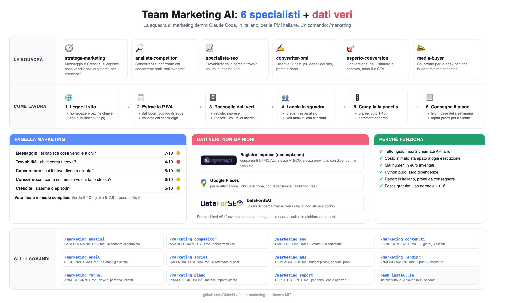

# Team Marketing AI

Una squadra di marketing completa dentro Claude Code, in italiano, pensata per le PMI italiane. **Incolli il link di un'azienda e la squadra parte da sola**: sei specialisti analizzano il sito in parallelo, studiano i concorrenti veri, ti mostrano com'è messa oggi, ti propongono cosa fare e ti consegnano un report visivo pronto per il cliente.



## Perché è diverso

La maggior parte degli strumenti "AI per il marketing" tira a indovinare: chiedi un'analisi dei concorrenti e ti risponde con nomi plausibili inventati sul momento. Questa suite no. La parte competitor lavora su dati reali:

1. **Legge la Partita IVA dal sito** dell'azienda che stai analizzando. Le aziende italiane devono esporla per legge, quindi c'è quasi sempre.
2. **Interroga il registro imprese** tramite openapi.com: profilo ATECO, sede legale, numero di dipendenti, fatturato. Poi cerca i concorrenti con lo stesso codice ATECO nella stessa provincia. Non "aziende simili secondo l'AI": aziende registrate che fanno la stessa cosa nello stesso territorio.
3. **Usa Google Places** per le attività locali: chi compare davvero quando un cliente cerca "idraulico Verona", con recensioni e valutazioni reali.
4. **Usa DataForSEO** per i volumi di ricerca veri delle parole chiave, non stime a occhio.

Il risultato è una fotografia del mercato basata su fonti verificabili, non su testo generato che suona bene.

## Il flusso completo, da un solo link

Scrivi `/marketing www.azienda.it` (senza sottocomando) e la squadra lavora in tre fasi, mostrandoti tutto mentre succede:

1. **Fotografia as-is.** I 6 agenti partono in parallelo, con il tabellone in diretta: li vedi lavorare e vedi entrare i voti uno a uno. Esce la Pagella Marketing: com'è messa l'azienda oggi, sulle 5 aree, coi concorrenti veri.
2. **Tutto il possibile, poi la proposta.** La squadra elenca ogni mossa fattibile con impatto e sforzo (la mappa delle opportunità), poi ti propone il sottoinsieme giusto per quel business e aspetta il tuo ok. Un idraulico di quartiere non si sente proporre le email dei carrelli abbandonati.
3. **Piano d'azione e report PDF.** Su conferma produce il piano a 90 giorni e un **report PDF professionale** (`REPORT-CLIENTE.pdf`): copertina editoriale, pagella coi voti, analisi area per area, radar del confronto coi concorrenti, matrice di cosa conviene fare e cosa no, piano a 90 giorni. Pronto da consegnare al cliente.

Preferisci lavorare a pezzi? Ogni fase è anche un comando a sé (vedi sotto).

## Installazione

```bash
git clone https://github.com/Giobebbe/team-marketing-ai.git
cd team-marketing-ai
bash install.sh
```

Poi riavvia Claude Code. I comandi `/marketing` saranno disponibili in qualsiasi progetto.

## I comandi, uno per uno

Oltre al flusso autonomo qui sopra, ogni pezzo si lancia da solo quando ti serve solo quello.

| Comando | Cosa fa | File prodotto |
|---|---|---|
| `/marketing analisi` | La Pagella Marketing completa: 6 agenti in parallelo valutano l'azienda su 5 aree con voto da 1 a 10 e semaforo | `PAGELLA-MARKETING.md` |
| `/marketing seo` | Analisi SEO del sito: parole chiave, volumi di ricerca reali, priorità di intervento | `PIANO-SEO.md` |
| `/marketing contenuti` | Piano editoriale: temi, formati e frequenza calibrati sul pubblico dell'azienda | `PIANO-CONTENUTI.md` |
| `/marketing email` | Sequenze email pronte da caricare: benvenuto, nurturing, recupero clienti | `SEQUENZE-EMAIL.md` |
| `/marketing social` | Calendario social di un mese con post già scritti | `CALENDARIO-SOCIAL.md` |
| `/marketing ads` | Struttura campagne a pagamento: pubblici, budget, testi degli annunci | `CAMPAGNE-ADS.md` |
| `/marketing landing` | Sistema una singola pagina: checklist 7 punti e riscritture pronte da incollare | `ANALISI-LANDING.md` |
| `/marketing funnel` | Mappa il percorso del cliente e trova il punto esatto dove si perde | `ANALISI-FUNNEL.md` |
| `/marketing competitor` | Concorrenti veri dal registro imprese e da Google Places, con confronto punto per punto | `ANALISI-COMPETITOR.md` |
| `/marketing opportunita` | La mappa di tutto il possibile: ogni mossa con impatto, sforzo e se ha senso per quel business | `MAPPA-OPPORTUNITA.md` |
| `/marketing piano` | Piano operativo di 90 giorni: cosa fare, in che ordine, con quali risorse | `PIANO-90-GIORNI.md` |
| `/marketing report` | Report PDF professionale (copertina, pagella, radar, matrice, piano) da consegnare al cliente | `REPORT-CLIENTE.pdf` |

## La squadra

Sei agenti specializzati, ognuno con il proprio file in `squadra/`:

- **stratega-marketing**: coordina, decide le priorità, scrive il piano
- **analista-competitor**: registro imprese, Google Places, confronto con i concorrenti
- **specialista-seo**: parole chiave, struttura del sito, trovabilità
- **copywriter-pmi**: testi concreti in italiano, senza gergo da agenzia
- **esperto-conversioni**: dal visitatore al cliente, form, offerte, pagine
- **media-buyer**: campagne a pagamento, budget, pubblici

## La Pagella Marketing

Il modello di valutazione è unico per tutta la suite: 5 aree, voto da 1 a 10, semaforo (verde, giallo, rosso).

| Area | Domanda a cui risponde |
|---|---|
| Messaggio | Si capisce in 5 secondi cosa vendi e a chi? |
| Trovabilità | Chi ti cerca ti trova? |
| Conversione | Chi ti trova diventa cliente? |
| Concorrenza | Come sei posizionato rispetto a chi fa la stessa cosa? |
| Crescita | Hai un sistema per crescere o vai a episodi? |

## Esempio d'uso

Apri Claude Code in una cartella qualsiasi e scrivi:

```
/marketing www.esempio-azienda.it
```

I 6 agenti partono in parallelo, e li vedi lavorare in diretta: uno legge il sito ed estrae la Partita IVA, uno interroga il registro imprese e cerca i concorrenti, uno controlla la trovabilità, uno valuta testi e offerta, uno il percorso di conversione, uno le opportunità sui canali a pagamento. Finita la fotografia trovi `PAGELLA-MARKETING.md` nella cartella, con una struttura tipo:

```
PAGELLA MARKETING - Esempio Azienda Srl

Messaggio      7/10  verde
Trovabilità    4/10  rosso
Conversione    5/10  giallo
Concorrenza    6/10  giallo
Crescita       3/10  rosso

Voto complessivo: 5/10
Le 3 cose da fare subito: ...
```

Ogni voto è motivato e ogni raccomandazione dice cosa fare, non solo cosa non va. Da qui la squadra ti mostra la mappa di tutto il possibile, ti propone su cosa concentrarti e, dopo il tuo ok, ti consegna il piano a 90 giorni e il report PDF `REPORT-CLIENTE.pdf`.

## Per chi è

- **Titolari di PMI** che vogliono capire dove perde colpi il loro marketing senza pagare un audit da migliaia di euro
- **Consulenti e agenzie** che vogliono produrre analisi e report per i clienti in una frazione del tempo (`/marketing report` nasce per questo)
- **Chi parte da zero** e vuole un piano di 90 giorni concreto invece di una lista di buone intenzioni

## Le chiavi (opzionali)

La suite funziona anche senza chiavi API: in quel caso gli agenti ripiegano sulla ricerca web. Con le chiavi arrivano i dati veri (registro imprese, Places, volumi di ricerca).

| Variabile | Dove ottenerla | Costo |
|---|---|---|
| `OPENAPI_TOKEN` | console.openapi.com | Fascia gratuita: 100 ricerche al giorno |
| `GOOGLE_PLACES_API_KEY` | Google Cloud Console | Fascia gratuita mensile inclusa |
| `DATAFORSEO_LOGIN` e `DATAFORSEO_PASSWORD` | dataforseo.com | A consumo, pochi centesimi a richiesta |

Per configurarle:

```bash
cp .env.example .env
# apri .env e incolla le tue chiavi
```

Nota su openapi.com: l'attivazione della Company API richiede una verifica d'identità con un documento (il registro imprese è un dato regolamentato, la richiedono a tutti). Si fa una volta sola dalla console: Company API, Activate, carichi il documento, aspetti l'approvazione e poi generi il token. Nel frattempo la suite funziona comunque: senza token la parte competitor usa la ricerca web.

## Quanto costa

Ogni script ha un tetto rigido di 1 o 2 chiamate API per esecuzione e stampa il costo stimato a fine run. Con le fasce gratuite dei tre servizi, un uso normale (qualche analisi a settimana) costa zero. Non ci sono chiamate nascoste né loop che consumano credito.

## Struttura del progetto

```
team-marketing-ai/
├── skills/          # le skill di Claude Code (una per comando)
├── squadra/         # i 6 agenti specializzati
├── scripts/         # script Python (dati reali in stdlib; generatore PDF con reportlab)
├── assets/          # font (Cormorant, DM Sans) e immagine di copertina per il report PDF
├── requirements.txt # reportlab (serve solo per il report PDF)
├── install.sh       # installazione
├── uninstall.sh     # rimozione pulita
└── .env.example     # modello per le chiavi API
```

Gli script dei dati reali (registro, Places, volumi) sono Python 3 puro, zero dipendenze. Il solo report PDF (`/marketing report`) usa **reportlab**: `pip3 install reportlab` (o `pip3 install -r requirements.txt`).

## Licenza

MIT. Vedi il file `LICENSE`.
